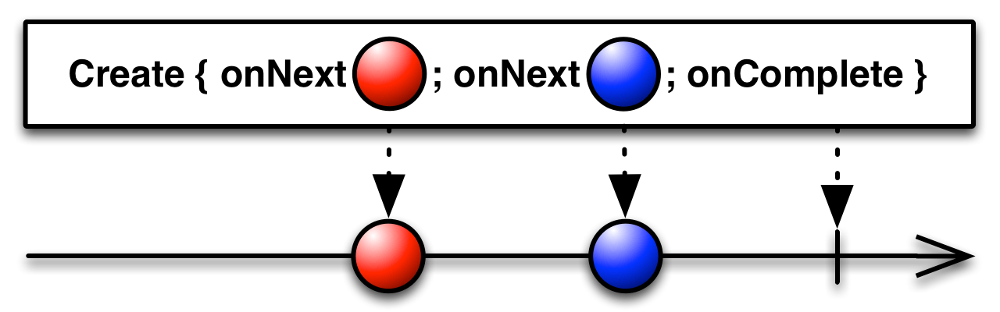
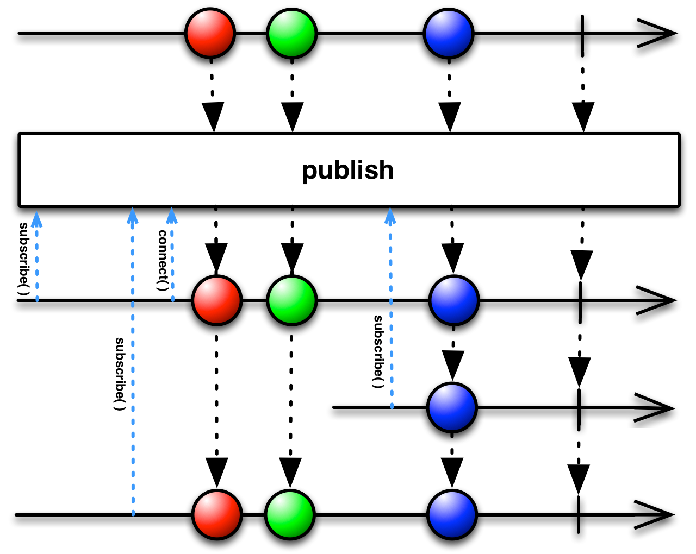

Chapter 02
===
Subject
---
* subject함수에 대해서 정리되어있는 패키지입니다.
* Link: https://github.com/MristerWing/PrivateProject/tree/master/2.java/reactivejava/src/main/java/com/gmx0807/reactivejava/chapter02/subject

---
Create
---

* 데이터를 인자로 넣으면 자동으로 알림 이벤트가 발생하는 just()와 달리 create()함수는 onNext, onComplete, onError와 같은 알림을 개발자가 직접 호출해야 하는 함수입니다.
* 구독자(subscribe())에게 데이터를 발행하기 위해서는 onNext()함수를 호출해야하며, 모든 데이터 발행이 완료되면 반드시 onComplete()함수를 호출해야 합니다.  
* 함수 원형  
<pre><code>Observable<T> create(ObservableOnSubscribe<T> source)
public interface ObservableOnSubscribe<T> {  
    void subscribe(ObservableEmitter<T> e) throws Exception;  
}</code></pre>

## Files
### ObservableCeateExample.java
* 기본적인 create 함수를 사용한 코드 입니다.
* crate함수의 기본흐름인 onNext, onComplete를 사용해 보았습니다.

---
From
---

* just()나 create()함수와 달리 다중 데이터를 발행할때 사용합니다.
* 배열이나 컬렉션의 데이터를 처리할때 주로 사용합니다.
* 또한 기존의 객체 or 절차식 프로그래밍에서 사용했던 loop구문으로 사용되기도 합니다.
* 파생되는 함수
    1. fromArray()
    2. fromIterable()
    3. fromCallable()
    4. fromFuture()
    5. fromPubilsher()

## Files
### ObservableFromArray.java
* fraomArray()함수를 사용한 예제입니다.
* 배열이나 컬렉션에 원하는 값을 넣은 후 fromArray()함수를 호출하면 데이터를 차례대로 발행합니다.
* java의 int 타입의 배열은 인식하지 못하기 때문에 Integer로 변환해야 합니다.
---
### ObservableFromIterable.java
* Iterable 인터페이스에서 Observable객체를 생성한는 예제입니다.
* ArrayList, HashSet, BlockingQueue를 사용해보았습니다.
---
### ObservableFromCallable.java
* 비동기 인터페이스인 Callable메소드를 이용한 예제입니다. 
* Callable은 Java5에서 추가되었습니다.
* Callable은 Runalble과 달리 리턴값을 가지는 인터페이스입니다.
* 람다식과 람다식을 사용하지 않은 방법을 사용해 보았습니다.
---
### OservableFormFuture.java
* Future인터페이스는 동시성 API로 계산의 결과를 구할 때 사용합니다.
* Future은 Java5에서 추가되었습니다.
* 대부분의 구현 방법은 Exector 인터페이스를 구현한 클래스에 Callable객체를 인자로 넣어 구현합니다. 
* 메소드를 호출하면 Callable에서 구현한 결과가 나올 때까지 블로킹됩니다.
---
### ObservalbeFormPulisher.java
* Publisher는 Java9에 추가된 Flow API중 일부입니다.
* Publisher는 기존의 RxJava와는 다른 패키지에 구현되어있습니다. (org.reactivestreams)
* Publisher는 create()와 마찬가지로 onNext()와 onComplete()를 호출할 수 있습니다.

---
Single
---

* Single은 RxJava 1.x부터 존재하는 Observable의 특수한 형태입니다.
* Sinhgle은 오직 하나의 데이터만 발행하는 class입니다.
* 보통 단일 서버 API를 호출할 때 사용합니다.
* 데이터가 하나 발행됨과 동시에 종료됩니다.(onNext와 onComplete가 통합됨)
* 하위 함수
    1. single()
    2. first()

## Files
### SingleExample.java
* Single클래스의 사용법을 정리한 예제입니다.
    1. Observable을 Single로 변환
    2. single()함수를 호출해 Single객체 생성
    3. first()함수를 호출해 Single객체 생성
    4. 비어있는 Observable에서 Single객체 생성
    5. take()함수를 이용하여 Single객체 생성

---
ConnectableObservable
---

* ConnectableObservable은 차가운 Observable을 뜨거운 Observable로 변환합니다.
* Observable을 여러 구독자에게 공유 할 수 있으므로 데이터하나를 여러 구독자에게 동시에 전달할 때 사용합니다.
* 특이사항으로는 connect()함수가 호출한 시점부터 subscribe()함수를 호출한 구독자에게 데이터를 발행 하기 때문에 subscribe()함수를 호출해도 아무 일도 일어나지 않습니다.
* ConnectableObservable 객체를 생성하려면 먼저 Observable에 publish()함수를 호출해야 합니다. 이는 여러 구독자에게 데이터를 발행하기 위해 connect()함수를 호출하기 전까지 데이터 발행을 유예하는 역할을 합니다.
* connect()함수를 호출해야지만 모든 구독자에게 데이터를 발행합니다.

## Files
### ConnectableObservableExample.java

* ConnectableObservable 동작방식을 이해하는 예제입니다.

---
ETC
---
## Files
### ObservalbeNotifications.java

[RxJava메인으로](https://github.com/MristerWing/PrivateProject/tree/master/2.java/reactivejava)
