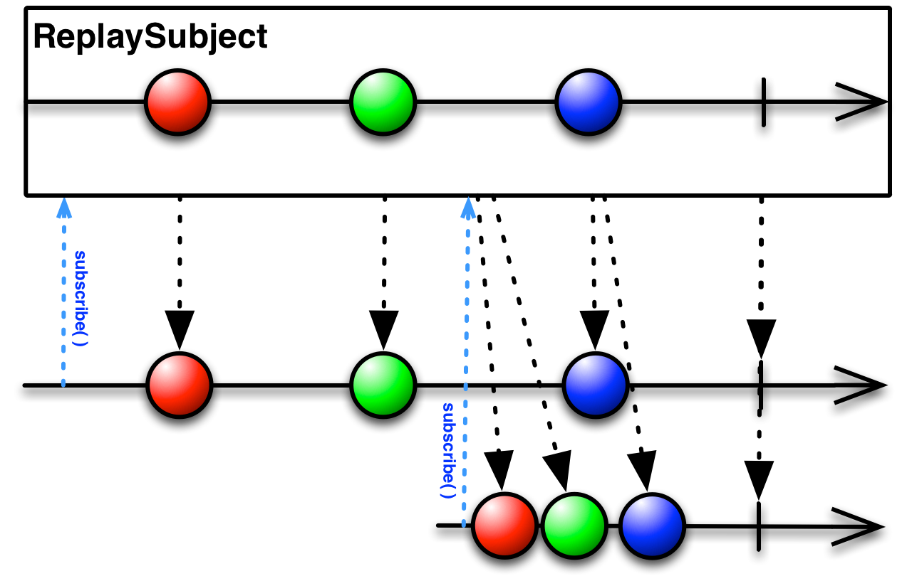

Subject
===
* Subject클래스는 차가운 Observable을 뜨거운 Observable로 변환해주는 객체입니다.
* Subject는 Observable의 속성과 구독자의 속성이 모두 있다는 점입니다.
* Observable과 같이 데이터를 발행할 수도 있고 구독자(subscribe)처럼 발행된 데이터를 바로 처리할 수도 있습니다.
* 구성함수
    1. AsyncSubject
    2. BehaviorSubject
    3. PublisherSubject
    4. ReplaySubjectExample

## Files
### AsyncSubjectExample.java

* AsyncSubject는 Observable에서 발행한 마지막 데이터를 얻어올 수 있는 Subject클래스 입니다.
* 완료직전의 데이터만 발행하며 이전의 데이터는 전부 무시합니다.
* 구독자가 여러명이면 마지막 구독이 완료되기 전까지는 데이터를 발행하지 않고 마지막 구독자가 구독을 완료했을때 마지막 데이터를 발행합니다.
* AsyncSubject는 구독자로도 동작할 수 있습니다.
---
### BehaviorSubjectExample.java

* BehaviorSubject는 구독자가 구독을 하면 가장 최근값이나 기본값을 발행하는 클래스입니다.
* BehaviorSubject는 AyncSubject와 다르게 createDefault()함수로 생성합니다. 이는 발행하는 값이 없을경우 기본값을 발행해야 하기 때문입니다.

---
### PublisherSubjectExample.java

* 가장 평범한 Subject클래스로 구독자가 subscribe()함수를 호출하면 발행을 시작하는 함수입니다.
* 오직 해당시간에 시작한 발생한 데이터만을 구독자에게 발행합니다.
* PublishSubject 클래스는 별도의 기본값을 제공하지 않고 AsyncSubject클래스처럼 create()함수를 호출하여 생성합니다.

---
### ReplaySubjectExample.java

* Subject클래스중 가장 특이하고 사용에 주의가 필요한 클래스 입니다.
* ReplaySubject는 구독자가 새로 생성되면 항상 데이터의 처음부터 끝까지 발행하는 것을 보장해주는 클래스입니다.
* 데이터를 저장해두는 과정에서 메모리누수가 발생할 수 있으므로 사용시 주의가 필요합니다.

[chapter02메인으로](https://github.com/MristerWing/PrivateProject/tree/master/2.java/reactivejava/src/main/java/com/gmx0807/reactivejava/chapter02)